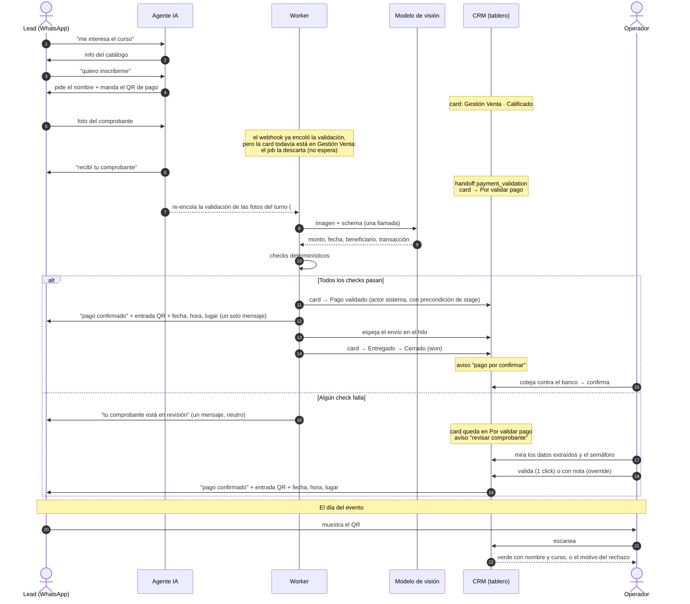
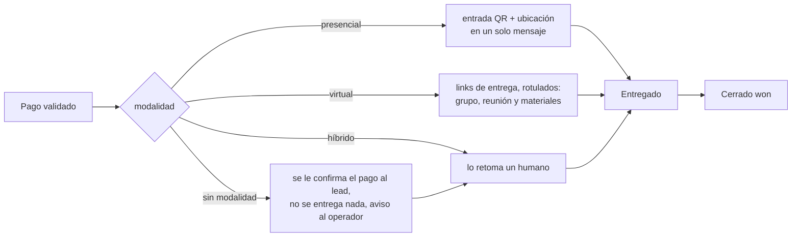
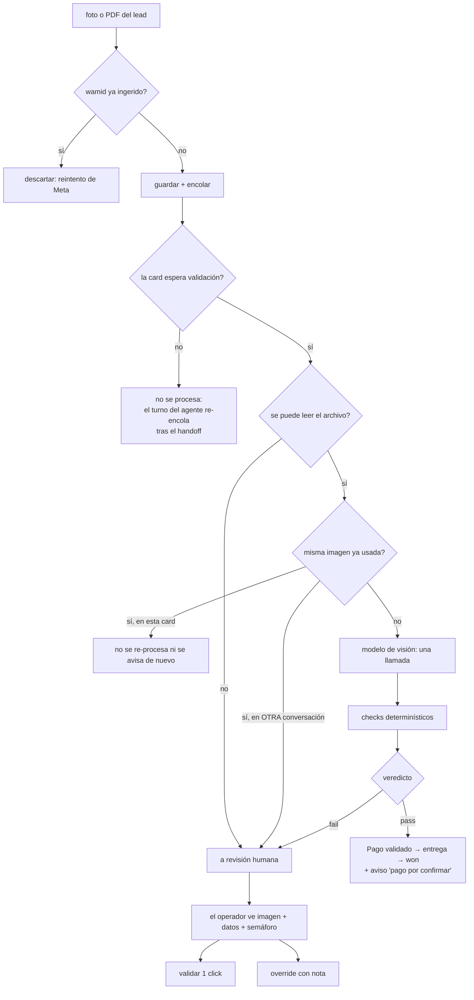
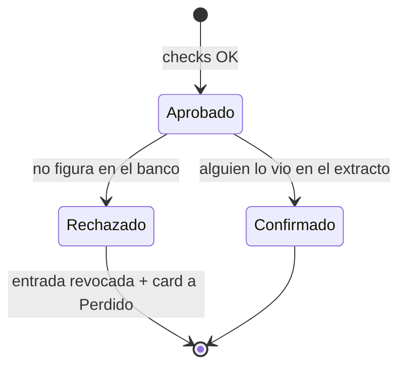
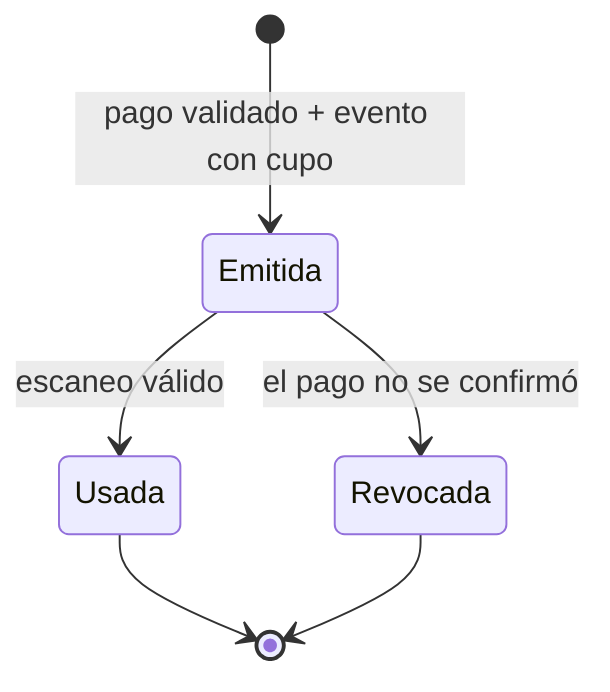

# Flujo de pago, entrega y eventos

> **Estado:** implementado y verificado (2026-08-23; correcciones de la UAT del 2026-08-29 en #290). Este documento describe lo que **está construido y probado**, no lo planeado. Cada afirmación de comportamiento tiene un test detrás.
>
> Fases: CR1 (#268) · CR2 (#270) · CR3 (#272) · CR4 (#274) · CR5 (#276) · CR6 (#278) · UAT (#290).
> Comportamiento del agente: [FLUJO_AGENTE.md](FLUJO_AGENTE.md) · Contratos: [SPECS_MVP.md](SPECS_MVP.md)

## 1. El principio que gobierna todo

**El modelo extrae, el código decide.** El LLM lee el comprobante y devuelve lo que ve; la aprobación la deciden checks determinísticos. La confianza que reporte el modelo **no es un criterio** — un modelo puede estar muy seguro de algo falso.

Y el sesgo es explícito: **la duda va a un humano.** Un dato ilegible, una moneda que no corresponde, un precio en rango, dos servicios en la misma card: todo eso bloquea la aprobación automática en vez de adivinar. Aprobar un pago que no entró cuesta mucho más que hacer esperar a alguien unos minutos.

## 2. Curso presencial, de punta a punta



### Stages del pipeline de postventa

> **Rename 2026-08-30 (migración 0035).** Los dos pipelines se llamaban por quién trabajaba en ellos — "Gestión IA" y "Gestión Humana" — y eso dejó de ser cierto con la validación y la entrega automáticas: hoy el sistema trabaja en los dos. Pasan a nombrarse por la fase del negocio: **Gestión Venta** (`kind: 'ia'`) y **Gestión Postventa** (`kind: 'human'`). Es rename de dato; el `kind` es el identificador estable y nada rutea por el nombre. En este doc "pipeline humano" y "pipeline de postventa" son el mismo.

| Stage | Qué significa | Quién mueve la card |
|---|---|---|
| Por atender | Pidió humano o falló el bot | el agente (handoff) |
| Por validar pago | Mandó comprobante | el agente (handoff) |
| Pago validado | El pago está aprobado | el **sistema** (checks OK) o el operador |
| Entregado | El lead recibió lo que compró | el sistema, después de enviar |
| Cerrado | Ganada | el sistema (auto-won) o el operador |
| Perdido | Se cayó (p. ej. el pago no se confirmó) | el operador o el rechazo de la conciliación |

Dentro de este pipeline **el stage es monótono**: solo avanza. Antes de CR2, cualquier mensaje del lead ("gracias", un sticker) re-sincronizaba la card a "Por validar pago" y deshacía el trabajo del operador. Cruzar de pipeline sí se permite: reactivar la IA con el toggle no es un retroceso, es un cambio de dueño de la conversación.

## 3. Curso virtual

Igual que el presencial hasta la validación del pago. La diferencia es lo que se entrega:



Un curso virtual **no genera entrada**: recibe links y no hay nada que escanear. Y **sin modalidad cargada no se entrega nada** — es el default seguro: mandarle una entrada a quien compró otra cosa es peor que no mandarle nada.

**Todos los links de entrega viajan rotulados** (UAT 2026-08-31): el grupo, la reunión y también los cargados como "otro" (p. ej. la materia del estudio), con el label que escribió el operador, en ese orden — y si hay dos del mismo tipo, van los dos. Antes solo salían el primer grupo y la primera reunión: un link "otro" se omitía en silencio mientras la UI del catálogo prometía que se enviaba tras el pago. Lo que **no** cambia es el gate de acceso: un link "otro" es complemento, no acceso — un virtual sin grupo ni reunión sigue bloqueado (`missing_link`) aunque tenga material, y un híbrido sin ellos entrega la entrada con el material y deja el aviso.

### 3.0 Qué dice el mensaje

Todo lo que el lead recibe al validarse su pago **abre confirmándolo** ("Tu pago está confirmado ✅") y lleva, una por línea, los datos a los que va a volver: **Fecha** (dd/mm/aaaa) y **Hora** en hora de Bolivia, **Modalidad**, **Lugar** y **Ubicación** (el link del mapa). Los toma del evento al que se liga la entrada — o de la copia que la entrada guardó al emitirse, si el evento después se borró (#290). Un curso virtual no tiene evento: lleva la confirmación, la modalidad y sus links.

**Si el plan se bloquea** (sin evento en la agenda, sin modalidad, virtual sin links, dos servicios, cupo lleno) el lead **no queda en silencio**: recibe *"Tu pago está confirmado ✅ En un momento te mando los detalles y el acceso 🙌"*, una sola vez por conversación (la marca `kind: payment_confirmed_notice` en el hilo es lo que hace idempotente el reintento), y la card queda con su aviso para que una persona termine la entrega. El pago **sí** está validado en todos esos casos — lo que falta es configuración —, y un lead que pagó y no recibe nada asume lo peor. Es el único mensaje que se manda con el plan bloqueado: ningún acceso a medias.

El botón manual **"Generar entrada"** pasa por el mismo `DeliveryPlanner` que la entrega automática: manda exactamente el mismo mensaje (antes mandaba el caption presencial pelado, sin ubicación ni links de Zoom, también para un híbrido).

### 3.1 Curso híbrido

Hay una tercera modalidad, `hibrido`, y no es un caso de borde: **el único servicio del catálogo que se cobra por QR es híbrido.** El *Curso de Creación de Contenido y Edición* son 4 módulos con un solo pago de 650 Bs — uno presencial (producción audiovisual) y tres por Zoom (CapCut básico, CapCut avanzado, IA aplicada).

Ni `presencial` ni `virtual` entregan ese curso completo:

| Modalidad | Entrega | Deja afuera |
|---|---|---|
| `presencial` | entrada QR + ubicación | el link de Zoom de los 3 módulos virtuales |
| `virtual` | los links | la entrada — en la puerta del módulo presencial no hay qué mostrar |
| **`hibrido`** | **entrada QR + ubicación + los links, en el mismo mensaje** | — |

Un solo mensaje y no dos, por el mismo criterio de #92: el lead vuelve a **un** mensaje el día de cada módulo. El copy dice "el día del módulo presencial" y no "el día del evento", porque el curso tiene cuatro fechas y el QR abre una sola.

**Híbrido nunca queda bloqueado**: siempre hay una entrada que mandar. Si falta la ubicación o falta el link de la clase, entrega igual y deja el aviso `missing_link` — la misma asimetría que el presencial sin ubicación, y por la misma razón: no se retiene algo ya pagado. Sí le aplica el gate del evento, porque emite entrada: sin evento cargado no entrega y avisa.

**Todo cambio de la agenda re-proyecta el snapshot del agente.** El bot lee los eventos de una copia en su config, no de la base, así que crear o editar un evento tiene que reconstruirla — antes solo lo hacía tocar el catálogo, y cargar la agenda (un paso del deploy) dejaba al bot sin fechas. Las tres keys que escribe esa proyección (`services`, `categories`, `events`) están protegidas de que un guardado del form del agente las pise.

**Los links de entrega no se proyectan al contexto del LLM**, a propósito. Un link de grupo ahí es material que el modelo podría entregar antes de que el pago esté validado, o que un lead consiga con una inyección de prompt. El fulfillment los lee de la base, donde el estado del pago sí se puede exigir. Los **eventos sí** se proyectan: la fecha de un curso es información de venta que el lead pregunta *antes* de pagar.

## 4. El comprobante: de la foto al veredicto



**La aprobación queda escrita en el comprobante** (`approved_at`, `approved_by` = `system` o el uuid del operador; server#292). Hasta ahí el comprobante guardaba el veredicto y la conciliación, pero la aprobación vivía solo como un move de la card, y el panel del CRM no podía distinguir "validalo" de "ya está validado y entregado": seguía ofreciendo "Validar pago y entregar" sobre una card cerrada — y ese botón la retrocedía a "Pago validado" y **volvía a entregar** al lead. Las tres formas de aprobar la registran: los checks en verde (solo cuando efectivamente movieron la card; si un humano la movió mientras tanto, queda sin aprobar y el panel ofrece validarla), el botón del panel (1 click u override) y **arrastrar la card a "Pago validado"**, que por §2 es validar. La primera aprobación es la que cuenta: un click sobre un pago que el sistema ya aprobó solo reintenta la entrega. Y `validate`/`override` responden 400 cuando la card ya pasó "Pago validado" (Entregado, Cerrado); "Perdido" sigue permitido, porque resucitar una oportunidad caída es una decisión, no un doble click.

El panel del CRM lee el comprobante por precedencia: **rechazado** > **confirmado** > **aprobado** (por el sistema, con link a la cola de conciliación mientras falte el cotejo; o a mano, con su nota) > **pendiente** (checks en verde, nadie aprobó: 1 click) > **revisión** (checks en rojo: nota obligatoria). Solo los dos últimos tienen acciones.

### Dos disparadores de la validación

El job de visión solo trabaja sobre una card que **ya está en "Por validar pago"**; si no, la descarta sin reintentar. Y la card llega ahí por el handoff del agente, que tarda los segundos de una llamada al LLM — mientras que el chequeo del job es una lectura de milisegundos. El webhook encolaba las dos cosas a la vez, así que en el caso normal (el lead manda la foto directo) el job corría primero, veía la card en Gestión Venta y el comprobante **nunca se validaba**: sin `payment_receipt`, sin panel, sin auto-aprobación ni cola de conciliación. Solo funcionaba si el lead escribía "ya pagué" antes de mandar la foto (#290).

Por eso la validación tiene dos disparadores, igual que la entrega:

| Disparador | Cuándo alcanza |
|---|---|
| El **webhook**, al llegar la foto | La card ya esperaba: el lead dijo "ya pagué" primero, o manda una segunda foto |
| El **turno del agente**, después del handoff (`receipt_trigger`) | El caso normal: la foto llegó con la IA activa y el turno movió la card |

El segundo re-encola las fotos **del turno que derivó** (las filas del lead con media por encima del `answered_through_order` con el que arrancó el turno). Idempotente por wamid en las dos puntas: `payment_receipt` de un lado, el lock de la cola del otro. Límite conocido: una foto respondida en un turno anterior *sin* handoff no se re-encola — la valida el operador desde el panel (ver §11).

### Los checks

| Check | Qué exige | Por qué así |
|---|---|---|
| `price` | El servicio tiene un precio **numérico** | Un precio en rango ("1.800 / 3.000") no se puede validar: cualquiera de los dos montos sería correcto |
| `currency` | El servicio está en Bs | No hay tasa de cambio en el sistema; un servicio en USD lo confirma el equipo |
| `amount` | Monto **exacto** | Sin tolerancia: un sobrepago o un pago parcial es justamente lo que un humano tiene que mirar |
| `beneficiary` | Coincide con el configurado | Matching tolerante: mayúsculas, tildes, orden invertido, truncamiento y máscaras |
| `date` | ≤7 días y no futura | Un comprobante viejo puede ser de otra compra; una fecha futura delata edición |
| `reference` | Trae el número de transacción | **Sin él no se puede detectar el reuso**, así que nunca se auto-aprueba |
| `reused` | Esa transacción no se usó antes | La misma transferencia no puede pagar dos compras |

**Anti-reuso: dos constraints, no lógica.** `unique(org, reference)` impide que la misma transferencia pague dos veces; `unique(org, image_sha256)` impide reenviar la misma captura, y funciona incluso cuando el número no se pudo leer.

### Lo que el prompt de extracción sabe de los bancos bolivianos

Cada instrucción existe por un formato real:

1. **El identificador se llama distinto en cada banco**: "Nro. de transacción" (ZAS), "Bancarización" (BNB, formato `2P…`), "Nro." (Ganadero), "Código de transacción" (Mercantil). Y **"Referencia", "Nota" y "Concepto" NO son el identificador** — son texto libre de quien paga, y en comprobantes reales traen cosas como "pasanaco", "Almuerzo", o **el nombre y la cuenta de un tercero**, que es justo lo que confundiría a un extractor ingenuo.
2. **Los montos mezclan convenciones**: "Bs 10,000.00" (coma de miles), "Bs46.00" (pegado al símbolo), "122.5", "6000". Se pide el número tal como está y lo normaliza el código, que sabe la regla: un punto seguido de tres dígitos es separador de miles ("5.500 Bs" son 5500, no 5.5).
3. **Hay dos nombres en todo comprobante** (quien paga y quien recibe) y confundirlos invierte el sentido de la validación: se pide explícitamente el del destinatario.

### Lo que queda cuando no se aprueba solo (UAT 2026-08-31)

En la UAT del 2026-08-31 el sistema frenó bien un comprobante viejo, pero quien lo retomó tuvo que deducir el porqué: el resumen IA solo decía que había llegado un comprobante, y el motivo vivía únicamente en el panel. Ahora todo fallo de la validación deja tres rastros:

- **El resumen IA dice qué subsanar.** Al resumen del handoff se le agrega una nota **determinística** (sin LLM; `crm/domain/receipt_summary.py`) con el `detail` de los checks en rojo — el mismo texto que muestra el panel, que sigue siendo la vista autoritativa. Un fallo nuevo **reemplaza** la nota anterior (nunca se apilan) y una aprobación posterior **la borra**: una nota vieja sobre un pago aprobado diría "subsaná algo" que ya no existe. Un handoff posterior pisa el resumen entero, nota incluida — aceptable: la card ya cambió de contexto.
- **El evento `receipt_needs_review`** (`{card_id, conversation_id}`) sale al canal del CRM para adelantar el refresh de board + card + panel. Best-effort: el poll del front lo mostraría igual.
- **La misma captura desde otra conversación deja fila.** Antes se descartaba en silencio — card esperando, panel vacío, nadie enterado — que es justo la forma de un fraude por captura reenviada. Ahora queda un `payment_receipt` en `fail` con el check `reused` (y la fecha en que se procesó la original), el aviso `receipt_review` y el mensaje neutro al lead. El sha se guarda como placeholder (`reused:{wamid}`): el unique anti-reuso sigue en manos de la fila original. El reenvío del mismo lead en la misma card sigue silencioso (ya se le respondió); cada intento cross-card deja su fila y avisa de nuevo — es evidencia, no ruido.

### El mensaje al lead cuando falla

**Uno, neutro**: *"Recibí tu comprobante, lo estamos revisando y te confirmamos en un rato"*. No dice qué check falló — al lead honesto no le sirve, y al deshonesto le regalaría el criterio exacto de qué editar.

## 5. Conciliación: por qué el pago aprobado no está terminado

Un comprobante es una imagen, y una imagen se puede editar. El sistema aprueba y entrega para que el lead no espere, pero **nadie puede afirmar que el dinero entró** hasta que alguien lo coteja contra el extracto.



Es un estado del **comprobante**, no del funnel: la card sigue su curso normal y la cola de conciliación va en paralelo. El **rechazo exige nota**: revierte algo que ya se entregó, y sin el motivo escrito nadie puede reconstruir después por qué se le anuló la entrada a alguien.

La entrada revocada **no se borra**. El lead ya tiene el QR en su teléfono: borrar la fila no le quita el QR, solo hace que en la puerta no se encuentre nada y no se sepa qué decirle. Se marca, y el escáner la rechaza con su motivo.

**La revocación tiene un único escritor y ninguna reconciliación posterior**, así que lo que no se graba en el rechazo no se graba nunca. Es la razón por la que todos los caminos del rechazo commitean, incluso los que no mueven la card: un rechazo sobre una card que ya estaba en "Perdido" se perdía entero en el rollback de la sesión del request, y el operador veía un 200 mientras el escáner seguía admitiendo la entrada en la puerta.

**El CSV del día es el día boliviano**, no el día UTC: se coteja contra un extracto bancario de Bolivia. Con los límites en UTC faltaba todo lo posterior a las 20:00 locales, que aparecía en el archivo del día siguiente — justo lo que se estaba buscando.

**Un pago que un humano aprobó a mano no vuelve a la cola** (`human_note` distinto de nulo): ya pasó por ojos humanos, y pedir el mismo trabajo dos veces es la forma más rápida de que se deje de hacer. Ese override **ocupa el unique anti-reuso** igual que una aprobación automática: si no, la misma transferencia queda reusable y una segunda card puede auto-aprobarse con ella.

## 6. Eventos y control de acceso

Un **evento** es una edición concreta de un servicio presencial: cuándo, dónde y para cuántos. Tabla propia y no campos en el servicio porque son dos ciclos de vida: un servicio es lo que se vende y dura; un evento ocurre y pasa, y un mismo curso tiene varias ediciones al año.

La entrada guarda `event_id` **y una copia** de la fecha y el lugar: en la puerta tienen que poder leerse aunque después alguien edite o borre el evento.



### Los veredictos del escáner

| Veredicto | Qué se le dice a quien atiende | Entra |
|---|---|---|
| `ok` | Entrada válida, con nombre y curso | sí |
| `legacy` | Emitida antes del sistema de eventos: verificar a mano | sí, con aviso |
| `already_used` | Ya se usó a las HH:MM — y **de quién es** | no |
| `wrong_event` | Es de otro evento, **nombrando cuál** | no |
| `revoked` | El pago no se pudo confirmar | no |
| `not_found` | No es una entrada nuestra | no |
| `payment_qr` | **"Eso es el QR de pago, pedile la entrada"** | no |

**Un escaneo nunca devuelve un error HTTP por rechazar.** Siempre 200 con el motivo: en la puerta hay una fila, un 4xx se lee como falla de conexión, y lo que hace falta es que la persona **lea qué pasó**.

**Un solo uso, garantizado por la base**: el consumo es un `UPDATE ... WHERE used_at IS NULL` en una sola sentencia. Leer-y-después-escribir dejaría una ventana en la que dos personas escanean el mismo QR a la vez y **las dos entran** — y eso no es teórico: alguien reenvía su QR por WhatsApp y dos personas lo muestran en filas distintas.

**El QR no lleva ningún dato del lead**: el token es un uuid4 opaco y todo lo que se muestra sale de la base. Un QR con el nombre adentro sería legible por cualquiera que lo fotografíe.

**Lista de asistencia con check-in manual** como fallback: un teléfono sin permiso de cámara o un QR arrugado no puede dejar afuera a alguien que pagó.

El check-in manual es un endpoint aparte (`POST /crm/entries/{entry_id}/check-in`) y no el mismo del escaneo, por dos razones:

- **Va por `entry_id`, no por token.** Los tokens no salen de la base: son el secreto que hace válido al QR, y exponerlos en la lista convertiría la pantalla de la puerta en una fuente de entradas copiables.
- **Queda marcado** (`qr_entry.used_manually`). Es la única vía por la que alguien entra sin mostrar su QR, y después del evento la pregunta "a quién dejamos pasar a mano" necesita respuesta durable. No alcanza un log: los logs de esta aplicación no sobreviven a un deploy (#260).

**Rechaza por los mismos motivos que el escaneo.** Existe porque la cámara puede fallar, no para saltear una entrada anulada o ya usada — de ahí que las dos vías compartan la lógica de admisión (`services/entry_admission.py`) en vez de tener cada una la suya.

**La lista incluye las entradas revocadas** a propósito: quien atiende necesita poder decirle a alguien que su entrada fue anulada, no que "no aparece".

## 7. Avisos operativos de la card

Códigos que el CRM traduce. Todos significan lo mismo en el fondo: **el sistema hizo lo máximo que podía sin arriesgar, y ahora decide una persona.**

| Código | Situación |
|---|---|
| `receipt_review` | El comprobante no pasó los checks |
| `payment_unconfirmed` | Aprobado, esperando el cotejo con el banco |
| `needs_name` | Se entregó, pero falta el nombre para cerrar |
| `delivery_pending` | La ventana de 24 h de WhatsApp está cerrada; se reintenta al próximo mensaje |
| `extra_receipt` | Llegó otro comprobante con el pago ya procesado |
| `no_modality` | El servicio no tiene modalidad cargada |
| `missing_link` | Falta un link de entrega |
| `ambiguous_service` | Más de un servicio aceptado en la card |
| `no_event` | Presencial sin evento próximo cargado |
| `capacity_full` | El evento llegó a su cupo |

Dos reglas que explican varias decisiones del flujo:

- **Nada a medias al lead.** Si falta un dato para armar la entrega, no se manda un mensaje roto ni un "None": queda el aviso y lo retoma un humano.
- **Una entrega ya pagada no se retiene por un dato administrativo.** Si el lead no dio su nombre, **se entrega igual** y la oportunidad queda en "Entregado" con su aviso.

La asimetría entre esas dos reglas es deliberada: un curso **virtual sin links** no entrega nada (no hay qué mandar), pero un **presencial sin ubicación** entrega la entrada y avisa que falta el link — la entrada *es* la entrega, la ubicación es complemento.

**El pago validado se le confirma al lead aunque la entrega se bloquee** (#290). "Nada a medias" es sobre el acceso, no sobre el pago: el pago está validado y decirlo es cierto. Un solo mensaje neutro, una sola vez por conversación (§3.0); si el envío falla (ventana cerrada, Meta caído) no se reintenta — el aviso de la card es lo que trae al humano, y ese sí queda.

**Cargar o editar el evento reintenta las entregas que lo esperaban.** Una card en "Pago validado" con `no_event` o `capacity_full` se entrega en el mismo request en que se guarda el evento de su servicio (tercer disparador de la entrega, `retry_deliveries_blocked_by_event`); las cards sin uno de esos avisos no se tocan. Antes el operador tenía que darse cuenta y apretar el botón.

**Una entrada ya emitida se reenvía sin volver a pasar por el gate del evento.** Cuando el primer envío falla por la ventana de 24 h, la entrada ya quedó emitida y guardada: reevaluar el cupo en el reintento lo encontraría lleno **por su propio asiento**, y el aviso resultante (`capacity_full` o `no_event`) reemplazaría a `delivery_pending` — que es el único disparador del reintento. El lead quedaría pagado, con el asiento reservado, y sin recibir nunca su QR por el camino automático. La emisión pasa por el gate; el reenvío, no.

**`delivery_pending` y los avisos de entrega son mutuamente excluyentes**: el que llega último reemplaza al anterior. Es lo que hace que perder `delivery_pending` sea grave y no cosmético.

## 8. Contratos nuevos

### Endpoints

| Método y ruta | Para qué |
|---|---|
| `GET/POST /catalog/services`, `PUT /services/{id}` | Catálogo, ahora con `modality` y `price_amount` |
| `GET/POST /services/{id}/links`, `PUT/DELETE /service-links/{id}` | Links de entrega tipados |
| `GET/PUT /crm/payment-settings` | Beneficiario esperado y QR de pago por organización |
| `POST/DELETE /crm/payment-settings/qr` | Subir el QR (multipart, JPG/PNG ≤5 MB) o volver al global. Uno por organización: subir reemplaza el anterior y borra su archivo |
| `GET /crm/cards/{id}/receipt` | El comprobante con sus datos y su semáforo |
| `POST /crm/cards/{id}/receipt/validate` | Validar en 1 click (**valida y entrega** en una sola operación) |
| `POST /crm/cards/{id}/receipt/override` | Validar con nota obligatoria |
| `GET /crm/payments/pending` | Cola de conciliación, con contador |
| `POST /crm/payments/{id}/confirm` · `/reject` | Confirmar o rechazar (rechazar exige nota) |
| `GET /crm/payments/export?day=` | CSV para cotejar con el extracto |
| `GET/POST /crm/agenda`, `PUT/DELETE /crm/agenda/{id}` | ABM de eventos |
| `POST /crm/entries/redeem` | Escaneo en la puerta (siempre 200, con el motivo) |
| `POST /crm/entries/{entry_id}/check-in` | Check-in manual desde la lista (mismo shape de respuesta, mismos rechazos) |
| `GET /crm/entries/attendance/{event_id}` | Lista de asistencia |

> **`/crm/agenda` y no `/crm/events`**: esa ruta ya era el stream **SSE** del CRM, que autentica por `?token=` porque `EventSource` no puede mandar headers. Son dos cosas sin relación que comparten la palabra "evento".

### Tablas nuevas

`service_link` · `payment_settings` · `payment_receipt` (con los dos UNIQUE anti-reuso) · `event`

### Columnas nuevas

`service.modality`, `service.price_amount` · `card.flags` · `qr_entry.event_id`, `event_snapshot`, `revoked_at`, `revoked_reason`, `used_at`, `used_by`, `used_manually` · `payment_receipt.approved_at`, `approved_by` (server#292)

### Cola de trabajo

Dos colas Redis, no una: `agent:dispatch` (turnos del agente, lock por conversación) y **`agent:vision`** (validación de comprobantes, **lock por wamid**), con un loop propio cada una corriendo en paralelo.

El motivo es concreto: el worker es un consumidor **único y secuencial**, así que una llamada de visión de 15-20 segundos en la cola de turnos congelaría las respuestas de **todos los leads de todos los tenants** mientras dura, y además haría expirar el heartbeat de 60 s simulando un worker caído.

## 9. Estado de la matriz de pruebas

Los 32 casos del plan de pruebas, con lo que quedó verificado. La numeración es la del handoff.

| # | Caso | Estado |
|---|---|---|
| 1 | Happy presencial completo | ✅ |
| 2 | Happy virtual | ✅ |
| 3 | Monto distinto | ✅ |
| 4 | Beneficiario distinto | ✅ |
| 5 | Beneficiario enmascarado correcto | ✅ |
| 6 | Comprobante de más de 7 días | ✅ |
| 7 | Misma transacción desde otro lead | ✅ |
| 8 | Misma imagen reenviada | ✅ |
| 9 | Sin referencia legible | ✅ |
| 10 | Comprobante PDF | ✅ |
| 11 | Imagen ilegible / no-comprobante | ✅ |
| 12 | "Ya pagué" sin imagen | ✅ (comportamiento previo, intacto) |
| 13 | Servicio en USD o precio en rango | ✅ |
| 14 | Dos servicios aceptados | ✅ |
| 15 | "Gracias" después de Pago validado | ✅ |
| 16 | Retry de Meta con el mismo wamid | ✅ |
| 17 | Un humano descalifica mientras el job corre | ✅ |
| 18 | Segundo comprobante con la card entregada | ✅ |
| 19 | Lead sin nombre llega a won | ✅ |
| 20 | Virtual sin link cargado | ✅ |
| 21 | Presencial sin evento activo | ✅ |
| 22 | Cupo lleno | ✅ |
| 23 | Confirmación humana del pago | ✅ |
| 24 | Rechazo humano → entrada revocada | ✅ |
| 25 | Redeem válido | ✅ |
| 26 | Redeem doble (secuencial **y concurrente**) | ✅ |
| 27 | Redeem de otro evento | ✅ |
| 28 | Redeem de un QR de pago bancario | ✅ (con el payload real) |
| 29 | Redeem de entrada legacy | ✅ |
| 30 | Envío fuera de la ventana de 24 h | ✅ |
| 31 | Fallo de Meta en el fulfillment | ✅ |
| 32 | Override humano con nota | ✅ |

Y los casos que la matriz del handoff no tenía, agregados por la revisión adversarial posterior:

| # | Caso | Estado |
|---|---|---|
| 33 | Check-in manual: admite, y rechaza por lo mismo que el escaneo | ✅ |
| 34 | Rechazo de un pago sobre una card que ya estaba en "Perdido" | ✅ |
| 35 | Reintento de entrega de una entrada ya emitida (cupo y evento vencido) | ✅ |
| 36 | Override humano ocupando el unique anti-reuso | ✅ |
| 37 | Hora del escáner y día del CSV en hora de Bolivia | ✅ |

Y los de la UAT del 2026-08-29 (#290):

| # | Caso | Estado |
|---|---|---|
| 38 | La foto llega con la IA activa: el turno que deriva re-encola la validación (card en IA, texto solo, foto de un turno anterior, ya procesada, PDF) | ✅ |
| 39 | El resumidor recibe la conversación como un solo mensaje `user` (nunca un `assistant` final) | ✅ |
| 40 | Mensaje de entrega con confirmación + Fecha/Hora (hora de Bolivia, naive leído como UTC)/Modalidad/Lugar/Ubicación, en presencial, virtual, híbrido y en el botón manual | ✅ |
| 41 | Plan bloqueado: el lead recibe la confirmación una sola vez, espejada; si el envío falla queda el aviso de la card igual | ✅ |
| 42 | Crear el evento entrega las cards con `no_event` y deja en paz las que no tenían aviso | ✅ |

Y los de la UAT del 2026-08-31 (comprobante viejo detectado bien; lo que faltaba era el rastro y la entrega completa):

| # | Caso | Estado |
|---|---|---|
| 43 | El fallo de validación escribe la nota en el resumen IA; un segundo fallo la reemplaza y la aprobación la borra | ✅ |
| 44 | `receipt_needs_review` publicado al canal del CRM en todo fallo | ✅ |
| 45 | Misma imagen desde otra conversación: fila + aviso + mensaje neutro, sin llamada al modelo; mismo lead en la misma card sigue silencioso | ✅ |
| 46 | Entrega con links `other` rotulados y con segundos links del mismo tipo; virtual con solo material sigue bloqueado, híbrido con solo material entrega y avisa | ✅ |

**Cómo se verificaron:** tests automatizados sobre Postgres para las migraciones y SQLite para la suite (700 tests), con el modelo de visión stubbeado — lo que se prueba es **la decisión y sus consecuencias**, que es la parte determinística.

**Lo que esta verificación no cubría** — que el modelo lea correctamente un comprobante boliviano real — se cerró aparte el 2026-08-28 con una corrida contra la API real sobre los comprobantes de producción: ver §11 y `scripts/verify_receipt_extraction.py`.

## 10. Checklist de deploy

En este orden. Nada de esto se hizo: la iniciativa completa se desarrolló sin tocar producción.

### 1. Antes de migrar

```sql
-- Si devuelve filas, el índice único de wamid no se va a poder crear.
SELECT message->>'wamid', count(*) FROM ai_chat_histories
WHERE message->>'wamid' IS NOT NULL GROUP BY 1 HAVING count(*) > 1;
```

### 2. Migraciones

`alembic upgrade head` aplica en orden: `0027` (catálogo y config) → `0028` (avisos + rename del stage) → `0029` (comprobantes + dedup wamid) → `0030` (revocación + stage "Perdido") → `0031` (eventos) → `0032` (uso de la entrada) → `0033` (marca de check-in manual) → `0034` (aprobación del comprobante, con backfill de lo ya aprobado; server#292).

**Dos cambios visibles en el tablero** que conviene avisarle al operador antes de que los vea: el stage "Entrada enviada" pasa a llamarse **"Entregado"**, y aparece un stage nuevo **"Perdido"**.

### 3. Scripts

```bash
docker compose exec backend python scripts/backfill_catalog_prices.py --dry-run
docker compose exec backend python scripts/backfill_catalog_prices.py
# Después de crear los eventos (opcional, solo liga lo que no es ambiguo):
docker compose exec backend python scripts/backfill_entry_events.py --dry-run
```

### 4. Configuración, sin la cual el flujo no arranca

| Qué | Dónde | Sin esto |
|---|---|---|
| **Beneficiario esperado** | `/crm` → config de pagos | **Ningún** comprobante se auto-aprueba (falla segura, pero todo cae a humano) |
| **Modalidad** de cada servicio | `/crm` → catálogo | No se entrega nada al validarse el pago. El curso de Mirko va en **`hibrido`** (ver §3.1) |
| **Links** de los cursos virtuales | catálogo → links | El virtual no entrega y avisa |
| **Eventos** del curso presencial | `/crm/agenda` | El presencial no entrega y avisa |
| **QR de pago de la organización** | `/crm` → config de pagos | Se usa el global de la plataforma (ver §11: riesgoso con más de un cliente) |

**Catálogo y agenda son dos cosas, y un evento presencial necesita las dos.** El **servicio** vive en el catálogo y es lo que se vende: nombre, precio, modalidad, links. El **evento** vive en `/crm/agenda` y es *una fecha concreta* de ese servicio: cuándo, dónde y para cuántos. "Evento Master Oratoria" es un servicio del catálogo con modalidad presencial **y además** un evento en la agenda ligado a él con fecha futura (`scheduled` o `active`; una fecha pasada no cuenta). Sin el evento, al validarse el pago se le confirma al lead pero la entrada no sale y la card queda con `no_event`; en cuanto se carga la fecha, esa entrega sale sola. Borrar el servicio del catálogo para "crearlo en la agenda" rompe la venta: el bot ya no lo ofrece y la card pierde qué entregar. La UI lo explica en el form del servicio y en la agenda (web#192).

**Sobre el beneficiario esperado:** el valor a cargar es el nombre **exacto** con el que Mirko figura como destinatario en un comprobante real. El QR de pago **no lo contiene** (ver §11), así que hay que mirar un comprobante de un pago que ya haya entrado. El matching tolera mayúsculas, tildes, orden invertido y truncamiento, pero no un nombre distinto.

**Resuelto:** el único servicio con `flujo_cierre=pago_qr` es `curso-contenido-edicion`, y su resumen lo describe como híbrido. La decisión fue **agregar la modalidad `hibrido`** en vez de forzarlo a una de las dos que había (ver §3.1); al cargar el servicio hay que elegir esa.

### 5. Smoke manual post-deploy

1. Mandar un comprobante real desde un WhatsApp de prueba y ver el veredicto en la card.
2. Validar un pago desde el panel y confirmar que la entrega sale (y se espeja en el hilo).
3. Escanear la entrada generada: verde. Escanearla otra vez: rechazo con la hora.
4. Escanear el QR de pago a propósito: tiene que decir "eso es el QR de pago".
5. Rechazar un pago en la cola de conciliación y verificar que su entrada queda revocada.

### 6. Recordatorio del prompt vivo

`persona.py` es **seed**: cambiarlo no migra los agentes que ya existen (precedente de #235). Esta iniciativa **no cambió la persona del agente**, así que no hace falta SQL quirúrgico. Si en el futuro se toca el prompt, hay que migrarlo aparte.

## 11. Deudas y riesgos abiertos

**~~Extracción no verificada contra comprobantes reales (#282).~~ Cerrada el 2026-08-28.** La corrida se hizo con `scripts/verify_receipt_extraction.py` sobre los 15 archivos de media entrante de producción, con Haiku 4.5 y el prompt y el schema del worker. De los 9 comprobantes bancarios reales, los **4 pagos a Mirko se leyeron completos y correctos** (monto, fecha, beneficiario, referencia y banco; el PDF también) y los 5 a terceros se leyeron bien y los frena el check de beneficiario; los 6 archivos que no son comprobantes devolvieron vacío. Salió un bug real: sobre el flyer del curso el modelo devolvió `<UNKNOWN>` en vez de dejar el campo vacío, y ese string **hacía pasar el check de referencia** además de ocupar el `UNIQUE (organization_id, reference)` — corregido en `receipt_extraction.py`, con tests. El script queda en el repo: se vuelve a correr cuando cambie el modelo, el prompt o el schema.

**El QR de pago no contiene el beneficiario.** El handoff asumía un payload EMVCo legible; decodificado, es un blob opaco (`base64(256B)|hex24`) y la imagen tampoco lo imprime. De ahí que el beneficiario esperado sea config editable y que afinarlo sea un paso de deploy.

**Sin UAT en navegador.** El frontend se verificó con lint, tipos y build, más los contratos leídos de los tests del backend. El repo web no tiene runner de tests. Falta usarlo contra un backend vivo.

**El QR de pago tiene un fallback global, y eso es una bomba de tiempo con el segundo cliente (#283).** `payment_settings.payment_qr_url` es por organización, pero si está vacío se usa `settings.payment_qr_url`, una variable de entorno de la plataforma. Hoy hay un solo tenant real y ese valor global **es el QR de Mirko**, así que el fallback funciona. En cuanto entre un segundo cliente que no cargue el suyo, sus leads recibirían el QR de Mirko y **le pagarían a la cuenta equivocada**.

No se cambió porque es una decisión de negocio y quitar el fallback ahora podría romper el flujo vivo: hay que confirmar primero que el QR de Mirko esté cargado en `payment_settings` y no solo en la env var. La alternativa correcta es **fallar y avisar** (un aviso en la card, sin mandar nada) en lugar de mandar el QR de otro. Decidirlo antes de onboardear un segundo cliente.

**Una foto respondida sin handoff no se re-valida sola (#290).** El segundo disparador de la validación solo mira la media del turno que derivó. Si el agente respondió a la foto sin derivar (le preguntó algo) y derivó en un turno posterior, ese comprobante no se re-encola: el operador lo ve en el hilo y valida desde el panel o mueve la card. No se agregó un fallback a "la última foto" porque en el camino "ya pagué" por texto validaría un flyer viejo y le diría "lo estamos revisando" a alguien que todavía no pagó.

**Ambiente de staging (#264).** Sigue sin existir: todo lo que toca WhatsApp se prueba contra el número de producción. Es el riesgo de fondo de cualquier verificación e2e real.

**Ventana de 24 h sin plantilla HSM (#267).** Fuera de ventana la entrega queda pendiente y se reintenta cuando el lead escribe. Si no escribe nunca, no se entrega sola: hoy lo resuelve el operador a mano.

**Meta acepta y valida después: un envío "exitoso" puede no llegar (UAT 2026-08-30).** El Cloud API responde 2xx apenas acepta el mensaje; el media enviado por `link` lo descarga y valida **después**, y si el archivo no cumple sus requisitos el mensaje muere sin que ninguna llamada falle. Así se perdió la primera entrada real: segno emite PNG grayscale de 1 bit y Meta exige "8-bit, RGB or RGBA" — el envío "salió bien", el stage avanzó a Entregado→Cerrado y el hilo espejó un mensaje que el lead nunca recibió. El PNG ahora se convierte a 8-bit RGB (#297; `scripts/regenerate_qr_pngs.py` repara los ya emitidos), pero la clase de fallo sigue abierta: la única señal de una muerte asíncrona son los `statuses` del webhook, que hoy se descartan (#298; aviso en la card, #299), y el cierre de fondo es enviar por upload + `id`, que valida en el upload (#300).

**El agente commitea antes de enviar.** En el camino del agente el turno se persiste y después se manda a Meta: si Meta rechaza, el hilo del operador muestra un mensaje que el lead nunca recibió. Es un bug preexistente, fuera del alcance de esta iniciativa, pero conviene tenerlo anotado.

**La entrada se commitea antes de que su envío tenga éxito.** Cuando el envío falla por la ventana de 24 h, la fila de `qr_entry` ya quedó guardada. Hoy es correcto y deliberado — el reenvío reusa el mismo token y el reintento saltea el gate, así que no se emite ninguna entrada de más —, pero significa que el `issued` de un evento cuenta entradas que todavía no están en el teléfono de nadie. Si en algún momento el cupo tiene que ser exacto contra lo efectivamente entregado, esto es lo que hay que revisar.

### Lo que cerró la revisión adversarial del 2026-08-23

Cinco bugs que la suite no cubría, todos con reproducción antes del arreglo. Se anotan porque el patrón se repite y conviene reconocerlo:

| Bug | La forma del error |
|---|---|
| El rechazo no persistía si la card ya estaba en "Perdido" | Delegar el commit a una función que sólo commitea cuando hace su trabajo |
| Una transferencia aprobada a mano quedaba reusable | Una defensa que se instala en un camino y no en su gemelo |
| La entrada pendiente se bloqueaba contra su propio cupo | Reevaluar un gate de creación en un camino de reintento |
| Hora en UTC en la puerta | Formatear para una persona con la zona del proceso |
| El CSV del día usaba límites UTC | La misma raíz, en otra pantalla |
| `GET /crm/agenda` cerrado a `staff` | Un veredicto inalcanzable desde la única pantalla que lo usa |
| El ABM de eventos no re-proyectaba el snapshot | Una escritura nueva que no avisa a quien lee |
| `_merge_config` protegía 1 de 3 keys server-owned | Una lista que no creció con lo que enumera |

Los tres últimos salieron de **releer los hallazgos que el refutador había descartado**. El refutador estaba instruido a refutar ante la duda — correcto para no perseguir fantasmas, pero deja pasar cosas reales: su salida es una lista priorizada, no un veredicto.

Los dos últimos son el mismo bug en dos lugares, y salieron de la misma causa: **no había una sola fuente para la zona del negocio**. Buscando el patrón aparecieron cuatro lugares más con la misma forma, dos de ellos con consecuencia real:

| Dónde | Qué hacía |
|---|---|
| Umbral de antigüedad del comprobante | Medía contra el día UTC, así que cada tarde hay cuatro horas en las que un comprobante del límite cuenta un día de más y **se rechaza por una fecha que no pasó** |
| `GET /crm/payments/export` sin `day` | "Hoy" era el día UTC: abrir el export después de las 20:00 locales pedía el día siguiente y devolvía un archivo vacío |
| CSV de contactos | Las columnas de fecha salían en hora UTC (bug preexistente, no de esta iniciativa) |
| Nombre del archivo de ese CSV | Fechado en día UTC, sin coincidir con su contenido |

Ahora la zona vive en `shared/timezone.py` y **todo lo que se le muestre a una persona como hora de reloj tiene que pasar por ahí**. `to_business_time` interpreta un valor sin zona como UTC y no como la hora del proceso, que era el segundo filo del mismo cuchillo: el mismo dato daba una hora distinta en la máquina de quien desarrolla y en el contenedor.
